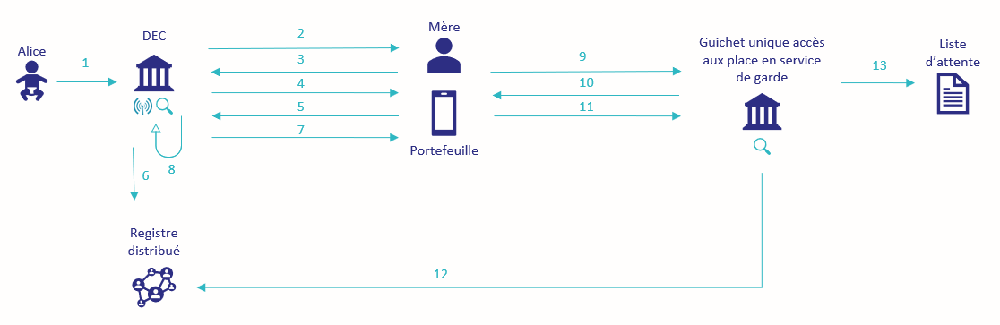
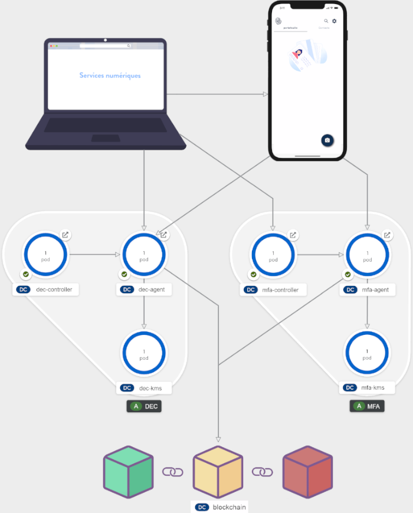
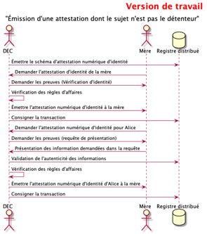
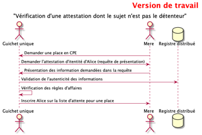
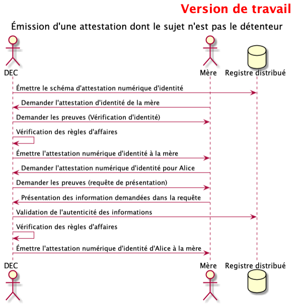

# Émettre une attestation d'identité dont le détenteur n'est pas le sujet, par un organisme qui connaît la relation 

Voici les travaux réalisés dans le cadre d'une expérimentation basée sur le concept de l\'identité numérique. Le sujet: l\'émission d\'une attestation d\'identité à un représentant (détenteur) d'un individu représenté (sujet) par un organisme émetteur qui connait la relation entre ces individus.

## Table des matières

1. [Objectifs](#10-objectifs)

2. [Contexte](#20-contexte)

3. [Environnement d\'expérimentation](#30-environnement-dexpérimentation)

   1. [Conditions initiales et prémisses](#31-conditions-initiales-et-prémisses)

   2. [Médias standard disponibles](#32-médias-standard-disponibles)

4. [Démarche](#40-démarche)

5. [Attestation d'identité numérique](#50-le-contenu-de-lattestation)

6. [Résultats attendus](#60-résultats-attendus)

7. [Analyse](#70-analyse)

   1. [Échanges avec la Colombie-Britannique](#71-échanges-avec-la-Colombie-Britannique)
   2. [Expérimentations](#72-expérimentations)
   3. [Personne autonome](#73-personne-autonome)
      1. [Le détenteur](#731-le-détenteur)
   4. [Autorité parentale](#74-autorité-parentale)
      1. [Le détenteur parental](#741-le-detenteur-parental)
      2. [Le sujet](#742-le-sujet)
      3. [L\'échéance](#743-léchéance)
      4. [Le statut de révocation](#744-le-statut-de-révocation)
   5. [Attestations et transactions](#75-attestations-et-transactions)

8. [Conclusion](#80-conclusion)

---

# 1.0 Objectifs

- Explorer les concepts techniques permettant de soutenir la relation détenteur-sujet d\'une attestation.

- Évaluer des modèles permettant de soutenir la relation parent-enfant(représentant/individu représenté ou détenteur/sujet) pour l\'attestation d\'identité gouvernementale lorsque l\'émetteur connait la relation.

# 2.0 Contexte

Le contrôle indirect de l\'identité, soit l'émission d'une attestion d'un
sujet à son représentant, est complexe. Un cas d\'utilisation
minimal a été élaboré afin de permettre la mise en place de toutes les
composantes nécessaires pour expérimenter le concept sans toutefois
régler les contraintes et particularités d\'un cas d\'affaires concret.

> _La petite Alice vient de naître. Le Directeur de l'État civil (DEC) consigne l\'événement dans ses
> systèmes de données et notifie les parents qu\'ils peuvent faire la
> demande de l\'attestation numérique d\'identité d'Alice. Sa mère, Sarah Courcy, en fait
> donc la demande . Les mois passent et les parents veulent
> inscrire Alice dans une centre de la petite enfance (CPE). Pour ce
> faire, la mère d\'Alice fait une demande au Guichet unique d\'accès aux
> places en service de garde._

<p align="center">
  

  <br>
  <b>Contexte de l'histoire d'Alice</b>
</p>

1.  Le DEC consigne la naissance d'Alice dans ses systèmes;

2.  Le DEC notifie les parents d\'Alice qu\'ils peuvent faire la demande
    de l\'attestation numérique d\'identité;

3.  La mère d\'Alice fait la demande de l\'attestation numérique
    d\'identité auprès du DEC à l\'aide de son portefeuille numérique;

4.  Le DEC requiert l\'attestation numérique d\'identité de la mère;

5.  La mère consent à présenter son attestation numérique d\'identité;

6.  Le DEC valide l\'attestation;

7.  Le DEC émet l\'attestation numérique d\'identité d\'Alice à la mère;

8.  Le DEC consigne l\'émission dans le dépôt de clé sécurisé de son agent.

9.  La mère fait une demande pour bénéficier d\'une place dans un CPE
    auprès du guichet unique d\'accès aux places en service de garde;

10. Le guichet requiert l\'attestation numérique d\'identité d\'Alice;

11. La mère consent à présenter l\'attestation numérique d\'identité
    d\'Alice;

12. Le guichet valide l\'attestation numérique d\'identité d\'Alice;

13. Le guichet accepte la demande et inscrit la jeune Alice sur la liste
    d\'attente;

# 3.0 Environnement d\'expérimentation

L\'environnement d\'expérimentation peut être créé et reproduit en suivant la
documentation se retrouvant sur ce lien [procédure d\'installation](README_install.md). Elle permet l/'installation et l/'exécution de l\'expérimentation.

## 3.1 Conditions initiales et prémisses

- Un (1) portefeuille numérique appartenant à la mère est disponible, 
- sur lequel son attestation d'identité est déjà disponible;

- Un répertoire distribué identitaire se conformant au _framework_
  _ARIES_ est en place et permet d\'émettre des attestations ainsi que les schémas associés;

- Un émetteur d\'attestations représentant le DEC est en place;

- Un consommateur d\'attestations représentant le guichet unique est en place;

- Une vérification d'identité n'est pas requise pour émettre l'attestation d'identité;

- Les notifications et publications entre les intervenants ne sont pas de la portée de l\'expérimentation. On assume qu\'elles sont exécutées de manière appropriée lorsque mentionnées;

- Le DEC connait la relation entre la mère et l\'enfant: elle est dans ses registres internes.

<p align="center">
  

  <br>
  <b>Shéma des composants utilisés pour réaliser l'expérimentation</b>
</p>

## 3.2 Médias standard disponibles 

Quelques médias d'image standards ont été crées et déposées dans le répertoire [d'Avatars](./images/Avatar). Ces images peuvent être utilisées dans les formulaires d'entrée de données de la PES d'émission d'attestation. 

# 4.0 Démarche

<p align="center">
  

  <br>
  <b>Diagramme de séquence - Émission d'attestation</b>
</p>

<p align="center">
  

  <br>
  <b>Diagramme de séquence - Vérification d'attestation</b>
</p>

## 5.0 Le contenu de l'Attestation

Voici le schéma de données utilisé pour l\'attestation d\'identité numérique ainsi que pour sa délégation:

```json
{
  "schema_name": "IQNIDENTITE",
  "schema_version": "0.1.3",
  "attributes": [
    "holder.id",
    "holder.type",
    "issuanceDate",
    "expirationDate",
    "credentialSubject.id",
    "credentialSubject.firstNames",
    "credentialSubject.lastName",
    "credentialSubject.gender",
    "credentialSubject.birthplace",
    "credentialSubject.birthDate",
    "credentialSubject.fatherFullName",
    "credentialSubject.motherFullName",
    "credentialSubject.registrationNumber",
    "credentialSubject.photo"
  ]
}
```

Par exemple, l\'identité de la mère émise pour elle-même en tant que détentrice pourrait être composée des valeurs suivantes:
|Nom de l'attribut | Valeurs |
|----------|---------|
|holder.id | Espace blanc |
|holder.type | Espace blanc |
|issuanceDate | 2020-10-08 |
|expirationDate | Espace blanc |
|credentialSubject.id | Clé publique du DID privé |
|credentialSubject.firstNames | Sarah |
|credentialSubject.lastName | Courcy |
|credentialSubject.gender | Féminin |
|credentialSubject.birthplace | Ville de Québec, Qc, Ca |
|credentialSubject.birthDate | 1976-11-08 |
|credentialSubject.fatherFullName | Mathieu Courcy |
|credentialSubject.motherFullName | Marie Courcy |
|credentialSubject.registrationNumber | 2aaf7216-1bf0 |
|credentialSubject.photo | Data de la photo |

---

<b>Tableau 1 - Données de l\'attestation d\'identité de la mère</b>

> Vous remarquerez qu'un espace blanc est utilisé lorsque la valeur est "null". Les valeurs "null" ne sont pas pris en charge dans un format json.

Autre exemple, l\'identité de l\'enfant émise à la mère en tant que détentrice pourrait être composée des valeurs suivantes:
|Nom de l'attribut | Valeurs |
|----------|---------|
|holder.id | Clé publique du DID privé du parent |
|holder.type | parent |
|issuanceDate | 2020-10-08 |
|expirationDate | La date de majorité de l'enfant |
|credentialSubject.id | Clé publique du DID privé |
|credentialSubject.firstNames | Alice |
|credentialSubject.lastName | Courcy |
|credentialSubject.gender | Féminin |
|credentialSubject.birthplace | Ville de Québec, Qc, Ca |
|credentialSubject.birthDate | 2020-10-06 |
|credentialSubject.fatherFullName | Michel Courcy |
|credentialSubject.motherFullName | Sarah Courcy |
|credentialSubject.registrationNumber | 4883-bcd7 |
|credentialSubject.photo | Espace blanc |

---

<b>Tableau 2 - Données de l\'attestation d\'identité de l'enfant</b>

# 6.0 Résultats attendus

Le schéma d\'attestation d'identité numérique se retrouve sur la chaîne de blocs. Elle est la structure d'information qui doit permettre:

- d\'identifier le sujet de l\'attestation;

- d\'identifier le détenteur de l\'attestation;

- d\'identifier la relation existante entre le détenteur et le sujet;

- de fixer la date d\'échéance de l\'attestation à la date de majorité
  du sujet.

L\'attestation d\'identité de la mère, Sarah Courcy, se retrouve dans
son propre portefeuille . Elle doit permettre:

- d\'identifier la mère comme étant le sujet de l\'attestation;

- d\'identifier implicitement la mère comme la détentrice de
  l\'attestation : la section _holder_ de l\'attestation n\'est pas
  présente.

L\'attestation d\'identité d\'Alice se retrouve dans le portefeuille de la
mère. Elle est distincte de l\'attestation d\'identité de la mère. Elle
doit permettre:

- d\'identifier Alice comme étant le sujet de l\'attestation;

- d\'identifier la mère comme étant la détentrice de l\'attestation :
  section _holder_;

- d\'identifier la relation existante entre Alice et sa mère;

- de fixer la date d\'échéance de l\'attestation à la date de majorité
  d\'Alice.

La vérification permet de valider :

- L\'émission d\'une requête de présentation exigeant la présentation
  des valeurs des attributs de l\'attestation d\'identité d'Alice;

- La présentation valeurs suivantes par la mère :

  - La date d\'échéance de l\'attestation;

  - La détentrice : Sarah Courcy;

  - Le sujet : Alice;

  - Le type de relation : _parent_ ;

  - La date de naissance d\'Alice;

---

# 7.0 Analyse

## 7.1 Échanges avec la Colombie-Britannique

La relation représentant la cellule familiale n\'est pas la plus facile à
gérer. Elle est, bien entendu, régie par des aspects juridiques. Ces
derniers sont parfois complexes mais ils répondent quand même à des
règles précises et peuvent donc être résolus à l\'aide de processus
d\'affaires et de concepts techniques.

Ce sont les considérations sociales et culturelles qui compliquent la
gestion de la relation familiale. Ces dernières sont problématiques car
elles peuvent être non normées et informelles. Tenter de gérer la
cellule familiale à l\'aide de processus d\'affaires et des concepts
techniques peut revenir à imposer un modèle culturel. Par exemple,
appliquer la représentation que l\'on pourrait faire de la relation
familiale d\'une culture d\'origine européenne à des individus issus d\'une
culture autochtone pourrait revenir à imposer un modèle incompatible à
la situation réelle.

C\'est pour ces raisons que la Colombie-Britannique a débuté
l\'implantation du concept de représentation n avec le volet entreprise : il
était plus simple de représenter les relations telles que _patron --
entreprise_, _relation employé -- entreprise_, _relation patron --
employé_.

Ses travaux sur le sujet amènent à penser qu\'il faut faire confiance 
à l\'écosystème et que le fardeau d\'identifier le bon sujet et le bon détenteur d\'une
attestation revient à l\'émetteur. Dans l'expérimentation, c\'est le
DEC qui devrait s\'assurer que:

- la mère est bien la « bonne » mère;

- Alice est bien la « bonne » Alice;

- la relation entre Alice et la mère permet d\'émettre l\'attestation à
  cette dernière.

En résumé, sans avoir la solution idéale, la Colombie-Britannique
considère qu\'il faut garder le modèle à sa plus simple expression afin
de représenter les relations familiales. On doit y représenter le
détenteur et le sujet le plus simplement possible. 

## 7.2 Expérimentations

Dans un modèle simple de contrôle indirect de l\'identité, c\'est la
relation _détenteur -- sujet_ qui permet ultimement à un individu de
« posséder » une attestation traitant d\'un autre individu.

### 7.3 Personne autonome

Dans le cas d\'une personne autonome, la relation est simple le détenteur
est le sujet de l\'attestation.

#### 7.3.1 Le détenteur parental

L\'hypothèse émise est que si le détenteur est le sujet, il n\'est
pas nécessaire de spécifier le champ *holder* : la relation est
implicitement définie. Après expérimentation, il semble que le champ
_holder_ ne peut être omis : ses valeurs peuvent être fixées à "null", 
en utilisant un espace blanc.

### 7.4 Autorité parentale

Dans le cas de l\'autorité parentale, la relation est encore simple : le
détenteur est le parent et sujet de l\'attestation est l\'enfant.

#### 7.4.1 Le detenteur parental

Ce cas de figure est représenté dans l\'expérimentation par l\'émission
d\'une attestation d\'identité à la mère d\'Alice. Le schéma du
_Verifiable Credential_ défini par le W3C comporte un champ _holder_.

```json
"holder": {"@id": "cred:holder", "@type": "@id"}
```

Le champ _id_ est destiné à identifier le détenteur à l\'aide d\'un DID (decentralized identifier).
L\'expérimentation soulève plusieurs questionnements concernant
l\'identifiant à utiliser. Doit-on utiliser le DID assigné lors de la
création du portefeuille? Si l\'individu a plusieurs portefeuilles,
lequel des DID doit être utilisé? Dans ce dernier cas, faut-il être
capable de relier tous ces portefeuilles au même individu? La solution
technologique pour y parvenir est appelée _device hub_ mais elle sort du
cadre de cette expérimentation.

On pourrait utiliser le DID de la connexion entre l\'émetteur et le
citoyen : cette connexion est unique mais elle est reliée à la connexion
entre deux entités du réseau et non à l\'identification d\'un individu en
particulier. Cette relation n\'est connue que par les 2 protagonistes et
ne peut donc pas être utile aux divers consommateurs de l\'écosystème
pour identifier le détenteur ou le sujet.

C\'est le champ _type_ qui permet de qualifier le lien entre le
détenteur et le sujet. Les valeurs possibles de ce champ doivent être
déterminées et publiées par l\'émetteur afin que l\'écosystème puisse les
exploiter. Selon notre compréhension des normes du W3C, il est possible
de combiner plusieurs valeurs afin de préciser la nature du lien. À
titre d\'exemple (pour démontrer le principe uniquement et non
représenter les cas d\'affaires pouvant exister), on pourrait penser à
une combinaison des termes « parent », « père », « biologique ». Un
consommateur ne pourrait être intéressé que par l\'aspect _parent_ pour
s\'assurer que l\'enfant est bien sous la responsabilité d\'une personne
qui veut son bien et un autre consommateur pourrait s\'intéresser aux
aspects _père_ et _biologique_ pour valider la pertinence ou non de
faire un test d\'ADN.

#### 7.4.2 Le sujet

Le sujet est représenté dans l\'attestation par un DID :

```json
"credentialSubject": {"@id": "cred:credentialSubject",
"@type": "@id"}
```

En plus des questions soulevées pour l\'identification du détenteur, le
DID d\'un bébé naissant est problématique. Alice n\'est pas en mesure de
posséder un portefeuille numérique : il faut donc trouver un moyen de
lui générer un DID. L\'utilisation d\'un portefeuille numérique pouvant
gérer plusieurs identités est une avenue potentielle qui permettrait à
un parent de générer ce DID initial.

#### 7.4.3 L\'échéance

La date d\'échéance est une valeur arbitraire fixée lors de l\'émission.
Elle relève des règles d\'affaires de l\'émetteur. Par exemple, dans le
cas présent, la date d\'échéance pourrait être la date à laquelle Alice
atteint la majorité. La mère d\'Alice ne pourrait dès lors plus utiliser
l\'attestation d\'identité d\'Alice quelle détient dans son portefeuille.
Par contre, cela n\'empêche pas Alice d\'utiliser sa propre attestation
d\'identité, contenue dans son propre portefeuille, qui elle n\'a pas de
date d\'échéance. Il ne semble pas y avoir de mécanique automatique de
validation de la date d\'échéance; il revient au consommateur de
s\'assurer que cette date est respectée.

Cela soulève la question de la conformité de la vérification : comment
s\'assurer que la vérification de la date d\'échéance par un consommateur
se fait en bonne et due forme? Plusieurs choses sont à valider sur la
valeur ainsi que sur le format des dates. Il y a des standards dans le
modèle de donnés d\'une attestation et certains outils reconnus sont déjà
disponibles. Il serait judicieux de fournir aux consommateurs certains 
_validateurs_ standardisés pour faciliter leur tâche. Cet aspect ne relève 
pas de la présente expérimentation.

#### 7.4.4 Le statut de révocation

Le statut de l\'attestation, par exemple si elle est révoquée ou non, doit faire
partie du processus de vérification du consommateur. C\'est l\'émetteur de
l\'attestation qui décide si l\'attestation est révoquée ou non selon ses
propres règles d\'affaires.

### 7.5 Attestations et transactions

Même si ce n\'était pas l'objet de l'expérimentation, il est important de mentionner qu\'elle
nous a permis de prendre conscience d\'un un aspect fondamental de la
chaîne de blocs de type Hyperledger-Indy. En effet, contrairement à l\'hypothèse
initiale, il n\'y a aucun enregistrement dans la chaine de blocs
d\'une transaction lors de l\'émission de l\'attestation. Les seuls
enregistrements dans la chaîne de blocs se font lors de l\'ajout d\'un schéma
et d\'une définition d\'attestation. L\'impact est positif sur la capacité
et les performances des infrastructures. Le diagramme de séquence de
l\'expérimentation devrait donc être le suivant :

<p align="center">
  
  
  <br>
  <b>Diagramme de séquence de l'expérimentation</b>
</p>

# 8.0 Conclusion

L\'expérimentation a permis d\'explorer les concepts soutenant la
relation _sujet-détenteur_ dans une attestation. La prémisse étant que
la relation est connue de l\'émetteur, ce dernier peut donc émettre une
attestation d\'identité contenant l\'information suffisante et nécessaire
à la description de ce lien.

Il faut que l\'attestation soit émise en accord avec les conditions
régissant la relation représentant/individu représenté : il faut un moyen
de redonner le plein contrôle de l\'identité à l'individu représenté dès que cela
est possible. Dans le cas retenu pour l'expérimentation, c\'est la majorité de l\'enfant qui servait
de critère. Il revient au consommateur d\'appliquer ses diverses règles
d\'affaires aux données présentées par le détenteur.

Il y a une opportunité de faciliter la vie des consommateurs
d\'attestations et d\'assurer une standardisation des processus de
validation en offrant des _validateurs_ à l\'écosystème. Cela n\'était pas
dans la portée de cette expérimentation. Une veille doit être faite à ce
sujet pour déterminer ce qui existe dans le domaine et une analyse doit
être réalisée sur la faisabilité de cette proposition.

Même si l\'expérimentation traitait de la représentation uniquement, 
plusieurs difficultés sont survenues relatives au modèle de
donnés de l\'attestation. Bien qu\'il soit avancé et reconnu par la
communauté, le modèle de l\'attestation vérifiable proposé par le W3C n\'a
pas encore atteint le statut de norme. Il existe plusieurs exemples et
implémentations mais elles ne convergent pas toutes vers une façon
unique de procéder. Certaines suppositions ont donc été faites
dans cette expérimentation afin de démontrer les concepts de la
représentation. Il y a une interdépendance très forte entre les
volets affaires et techniques au niveau de l\'attestation : seule une
compréhension claire des possibilités et limites qu'offre le
modèle de données peut aider à combler correctement les besoins
d\'affaires.

Notamment, si un consommateur veut interpréter les données d\'une
attestation, il doit pouvoir connaitre le champ des valeurs possibles.
Il faut donc que l\'émetteur publie ce dernier à l\'écosystème de même que 
l\'interprétation qui doit en être faite. La valeur d\'un champ _couleur_
peut contenir _bleu_ et _rouge_ pour un émetteur _et le consommateur
doit être en mesure d\'interpréter ces valeurs_. Il semble donc qu\'une
gouvernance doit être mise en place afin d\'éviter les conflits entre les
différents besoins d\'affaires et devrait dans ce cas-ci exiger
l\'utilisation de la norme régissant les informations d'identification vérifiables 
dans le schéma JSON (https://w3c-ccg.github.io/vc-json-schemas/).

Dans le même ordre d\'idée, cette observation a été faite avec l\'utilisation de
portefeuilles commerciaux : si quatre (4) attestations numériques d\'identité
 dans le portefeuille d\'un parent contiennent le champ
_NomComplet_, il devient problématique pour ce dernier de présenter les
champs provenant des bonnes attestations. Ce problème ne semble pouvoir
se résoudre que par l\'expérience utilisateur offerte par le
portefeuille. Sans avoir consacré beaucoup de temps à résoudre le
problème, aucun portefeuille satisfaisant n\'a été trouvé lors de
l\'expérimentation. 

Un autre problème qui est survenu lors de l\'expérimentation concerne l\'identité du
sujet ou du détenteur. Quels sont les DID devant être utilisés? Comment
faire pour identifier correctement le bon individu sans permettre la
corrélation? Si l\'individu a plusieurs portefeuilles, quel DID
doit-être sélectionné[^1]? L\'existance des DID uniques a été assumée pour
l\'expérimentation mais il y a une nécessité de répondre définitivement à
ces questions.

Finalement, la collaboration avec la Colombie-Britannique nous a
permis de réaliser que la représentation d\'une relation parent-enfant
peut être extrêmement compliquée si on tente de la représenter dans les
moindres détails. Plus on tente de la rendre parfaite, plus on risque
d\'imposer des aspects culturels, des aspects d\'affaires ou des aspects
technologiques qui ne feront qu\'écourter la validité de l\'attestation et
compliquer la vie du citoyen.

[^1]:
    
